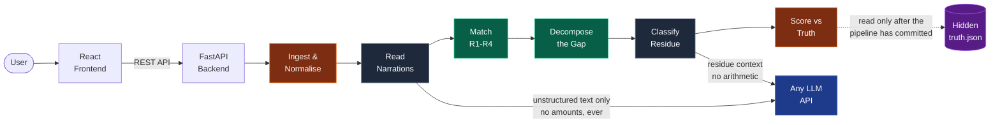
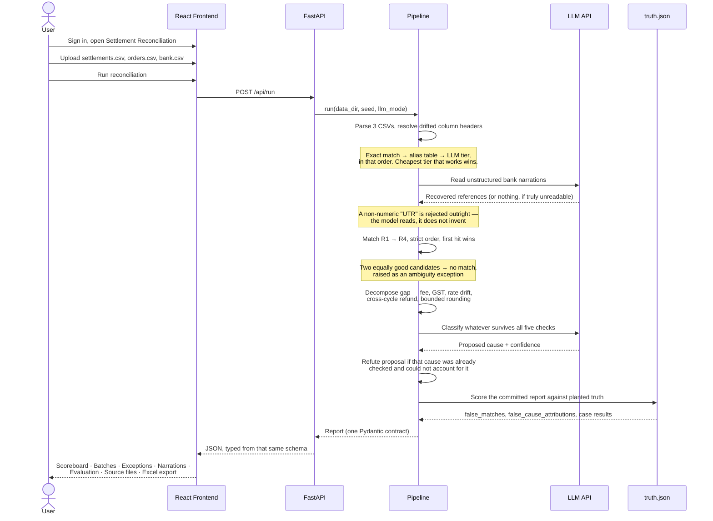

# Settlement Explainer — Reconciliation that proves its own accuracy.

**Razorpay Buildathon 2026 | Track 04: AI Finance Controller**

A merchant's dashboard says a settlement went out. The bank says a different number arrived. The difference is fees, GST on those fees, refunds that crossed a cycle boundary, adjustments — and occasionally something genuinely wrong. Today, finding out which is which is done by hand, in a spreadsheet, every cycle, by someone tracing individual transactions across three files whose identifiers don't line up.

This closes that loop: upload the three files, and get back not just a number, but the reasoning behind it — every rupee matched, explained, or honestly flagged.

The system is built on three commitments: **Determinism** (money never passes through a model — every rupee is matched and explained by plain, checkable arithmetic), **Proof** (accuracy is scored against a hidden answer key the engine never reads, not asserted), and **Honesty** (an unmatched batch or an unexplained rupee is a reported outcome, never something quietly rounded away).

```
Records processed          545   (275 settlement, 256 order, 14 bank)
Settlement batches           9
Runtime                    24ms

Matched deterministically    5   (55.6%)
Matched by inference         1   (11.1%)
Unmatched exceptions         3   (33.3%)

Gap explained       ₹13,390.67   (88.2%)
Gap unexplained      ₹1,800.00   (11.8%)

Planted cases            11/11   passed
FALSE MATCHES                0
FALSE CAUSE ATTRIBUTIONS     0
```

The two zeros are the point. **In reconciliation a wrong match is worse than an honest gap, because it silently closes the books on a real problem.** The match rate is deliberately under 100%, and the unexplained figure is exactly the amount planted as unexplainable — not approximately, exactly.

---

## System Architecture

### High-Level Design (HLD)



### Request Flow (LLD — Sequence Diagram)



---

## Test Dataset

No external download required — the dataset generates itself, deterministically:

```bash
.venv/Scripts/python -m recon.cli generate
```

This writes `data/settlements.csv`, `data/orders.csv`, `data/bank.csv` **and** `data/truth.json`, which records every defect planted and its exact value in paise. The same seed reproduces the same three files byte for byte, on any machine.

---

## Demo Video

https://github.com/user-attachments/assets/bd162a70-a375-4ed3-ac9c-f3ddf75b4462

---

## Product Walkthrough

The engine is wrapped in the sign-in → upload → reconcile flow a real merchant workspace would use.

**Landing.** The pitch in one screen: three source documents in, and only two honest outcomes out — reconciled, or clearly flagged.

**Sign in / Create account.** The gate any merchant-facing finance product puts in front of real financial data.

**Dashboard.** One live module — Settlement Reconciliation — with room for what comes next alongside it, plus a summary of the last run.

**Upload.** Three designated drop zones: settlement report, order records, bank statement. Reconciliation only starts once all three are attached — the merchant supplies exactly the three inputs the track specifies, not one pre-merged file.

**Reconciling…** The five-stage pipeline, narrated step by step as it actually runs: reading the files, extracting narrations, matching, decomposing gaps, classifying residue, scoring the result.

**Scoreboard.** Dataset summary of what was ingested, the headline numbers (order value → what Razorpay settled → what the bank actually credited → the gap), throughput, where the LLM ran, the match-rate split, gap attribution, and the correctness panel scored against planted truth.

**Batches.** One row per settlement batch — what the order book expects, what arrived, the gap, what was explained, what remains, and which rule closed it. Click any row for its full decomposition and trace.

**Exceptions.** Every rupee the system declined to reconcile, each stating what was tried, what was ruled out, and what would resolve it — because an exception a person cannot act on is just a different way of losing the problem.

**Narrations.** Every raw bank narration beside what was extracted from it, and by what — regex or model — so the AI's contribution is inspectable line by line.

**Evaluation.** All eleven planted cases scored against the hidden truth file, plus every attributed cause set beside the amount that was actually planted.

**Source files.** The three original CSVs exactly as ingested — inconsistent identifiers, varied narration formats, drifted headers and all.

**Download report.** One click produces a five-sheet Excel workbook — Summary, Batch Reconciliation, Gap Decomposition, Exceptions, Bank Narrations — with real currency formatting, frozen headers and filters, ready to file.

---

## Why the accuracy figures mean anything

Most reconciliation demos show a match and assert it was right. This one plants the answers first.

`recon generate` writes the three CSVs **and** a `data/truth.json` recording every defect it planted. The reconciler never reads that file — `recon/evaluate/` does, after the pipeline has returned a finished report. There is a test asserting the pipeline still runs with `truth.json` deleted, because the moment the reconciler can see the answers, every number on the scoreboard becomes worthless.

So `FALSE MATCHES: 0` is not a claim that nothing looked wrong. It means every committed match was checked against the bank line the generator actually paid, and none was wrong.

### The eleven planted cases

All eleven pass. Cases 6 and 10 are the ones that matter most: they are where the correct behaviour is to **refuse**.

| # | Case | Required output |
|---|---|---|
| 1 | Clean batch, UTR matches | matched by R1, residual 0 |
| 2 | Fees and GST only | fully decomposed, residual 0 |
| 3 | Refund settled in the next cycle | found by adjacent-cycle search, both ends resolved |
| 4 | Fee charged at 1.2% against a contracted 0.8% | flagged as rate drift |
| 5 | Narration corrupted with lookalike glyphs | matched by R1, **credited as inference** — recovered by the model where the regex could not |
| 6 | Two batches, identical amount, same day | **ambiguous → exception, not a guess** |
| 7 | Duplicate UTR across two bank lines | flagged, not double-counted |
| 8 | Bank credit with no settlement at all | exception |
| 9 | Settlement with no bank credit | exception, timing noted as an inference |
| 10 | Genuinely unexplainable ₹1,800 | **exception, no invented cause** |
| 11 | Bank column headers drifted from canonical names | all 14 rows still parse — alias tier, then LLM tier |

---

## Correctness by Design

This system treats a wrong answer as more expensive than no answer. That is enforced structurally, in five independent layers.

**Layer 1: Money never reaches the model.**
Two calls exist in the entire system — reading unstructured bank narration text, and proposing a cause for a leftover amount. Fee recomputation, GST, matching, and every rupee of arithmetic run in deterministic Python. The model translates text; it never computes.

**Layer 2: A proposed cause is checked, not trusted.**
Before an AI-proposed residue cause is accepted, the engine tests it against what the deterministic pass already established. If that same check already ran and attributed what it could, the residue is by definition what it *could not* account for — so the proposal is refuted, regardless of stated confidence.

**Layer 3: Two thresholds gate every commitment.**
**0.85** to commit a match, **0.70** to attribute a cause. Below either, the output is an exception rather than a downgraded guess. Refusing to answer is the correct answer wherever the evidence runs out.

**Layer 4: The answer key is architecturally unreachable.**
The reconciler's code path never imports or reads `truth.json`; a separate scoring module does, only after a finished report exists. A test deletes the file and asserts the pipeline still runs, keeping this true by construction rather than by convention.

**Layer 5: A degraded run never impersonates a healthy one.**
If a live LLM call fails, every caller falls back to its deterministic floor so nothing crashes — but the failure is counted and surfaced loudly, in the CLI and in the UI, instead of a clean-looking scoreboard built on a silent fallback.

```
Money boundary, enforced at every step:

  Three CSVs
        |
        v
  Ingest + normalise (local, typed)
        |
        v
  Narration text extracted  --->  sent to LLM (text only)
        |
        v
  Match + decompose (integer paise arithmetic, local)
        |
        v
  Residue context           --->  sent to LLM (no amounts computed by it)
        |
  Every rupee of arithmetic stops here, always
```

---

## How Settlement Explainer Compares

| Dimension | Manual / spreadsheet reconciliation | Settlement Explainer |
|---|---|---|
| Matching | Traced by hand across three files with mismatched identifiers | Four deterministic rules in strict order; AI only recovers unreadable references |
| Accuracy claim | Asserted, rarely verified | Scored against a hidden planted-truth file the engine never reads |
| Ambiguous cases | Resolved by whoever is doing it that day | Refused — reported as an exception with candidates listed |
| The AI's role | None, or an opaque "AI reconciliation" | Two narrow jobs, both inspectable, both subject to refusal |
| Wrong answers | Silently close the books on a real problem | Counted as the worst possible outcome, and measured at zero |
| Explainability | "Off by ₹X, not sure why" | Every rupee traced to a named, recomputed cause — or explicitly flagged |
| Rounding | Assumed away | Bounded and proven: at most 1 paise per payment plus 99 paise truncation |
| Reproducibility | Re-derived from scratch next cycle | Byte-identical data and a stable report hash from one seed |
| Output | A spreadsheet someone rebuilds monthly | Live report plus a five-sheet Excel workbook, every run |

---

## Features

**Upload three files, get a reconciled answer.** Settlement report, order records, bank statement — no manual merging first.

**Deterministic first, AI only where rules genuinely cannot reach.** Four matching rules and five gap checks run before any model is consulted.

**AI recovers what a pattern cannot read.** A narration corrupted with lookalike characters (`4O29I433OO98`) is read by the model and matched exactly — credited separately as *matched by inference*, never folded into the deterministic count.

**The model proposes, the engine disposes.** Every AI-proposed cause is checked against what is already established, and refused when it does not hold.

**Every exception states what was tried.** What was attempted, what was ruled out, what would resolve it — never a bare "unresolved."

**Provable accuracy, not a claim.** Eleven planted defects, a hidden answer key, and a score the engine cannot see while running.

**Byte-identical reproducibility.** One seed regenerates the same three CSVs and the same report hash, on any machine.

**Excel export.** Five sheets, real currency formatting, frozen headers, filters — a report a finance team can actually file.

**Runs fully offline.** No API key needed for any command; the demo replays committed fixtures rather than requiring the network.

**One contract, two languages.** Pydantic models emit the JSON schema the frontend's TypeScript types are generated from — rename a field in Python and the frontend fails to compile, rather than rendering `undefined` mid-demo.

**Light and dark themes**, with the choice remembered per browser.

---

## Tech Stack

| Layer | Technology |
|---|---|
| Frontend | React 18, Vite 6, Tailwind CSS v4 |
| Backend | Python 3.12, FastAPI, Uvicorn |
| Contract | Pydantic v2 → JSON Schema → generated TypeScript types |
| Engine | Pure Python — no ORM, no database, no persistent state between runs |
| Money | `int` paise throughout; exactly one rounding site in the system |
| LLM | Perplexity Sonar, or any OpenAI-compatible gateway, behind a provider interface |
| LLM modes | `off` · `stub` · `cache` · `live` — resolved most-offline-first |
| Excel export | ExcelJS, generated client-side, lazy-loaded |
| Testing | pytest — 97 tests |

---

## Install and Run

### Prerequisites

Python 3.12 or later, and Node.js 20 or later with pnpm.

### 1. Backend

```bash
python -m venv .venv && .venv/Scripts/pip install -e ".[dev]"
```

```bash
.venv/Scripts/python -m recon.cli generate   # write the dataset and its hidden truth
.venv/Scripts/python -m recon.cli run        # reconcile, score, write out/report.json
.venv/Scripts/python -m recon.cli verify     # prove the data and the run reproduce
```

### 2. Frontend

One process serves the API and the built page:

```bash
pnpm --dir web install && pnpm --dir web build
.venv/Scripts/python -m recon.cli serve --port 8020
# Opens at http://localhost:8020
```

For frontend development with hot reload, run Vite separately — it proxies `/api` to port 8020:

```bash
pnpm --dir web dev
```

No API key is needed for any of the above. Nothing reaches the network unless you ask it to.

### 3. Optional — live LLM mode

```bash
cp .env.example .env      # add your key
.venv/Scripts/python -m recon.cli run --llm live
```

Leave `PERPLEXITY_BASE_URL` unset for Perplexity direct (`pplx-` keys); point it at `https://openrouter.ai/api/v1` with `PERPLEXITY_MODEL=perplexity/sonar` for an OpenRouter key (`sk-or-`). Sending one service's key to the other's API earns a 401.

---

## Usage Example

```
Upload settlements.csv · orders.csv · bank.csv  →  Run reconciliation

-> 545 records reconciled across 9 settlement batches, in 24 ms.

-> 5 batches matched by rule alone. 1 matched only because the model could read a
   narration the regex could not. 3 honestly reported as exceptions rather than guessed.

-> ₹15,190.67 gap: 88.2% attributed to named causes (fees, GST, rate drift,
   a refund that crossed a cycle boundary, an unlinked adjustment).
   ₹1,800.00 left unexplained, because nothing in any of the three files accounts for it.

-> Asked to classify that ₹1,800, the model proposed a cause at 0.94 confidence.
   The engine refuted it — that check had already run and attributed what it could —
   so the amount stays unexplained and the exception records the refusal.

-> Scored against a hidden answer key: 11/11 planted cases pass,
   0 false matches, 0 false cause attributions.

-> Download report -> a five-sheet Excel workbook with the same numbers.
```

---

## Architecture Notes & Decisions Explained

### Deterministic where money is concerned. AI only where the input is unstructured.

| Task | Handled by | Why |
|---|---|---|
| Matching by exact identifier | Python | Exact, verifiable, reproducible |
| Fee recomputation, all arithmetic | Python | Never let a model do arithmetic on money |
| Reading bank narration strings | LLM | Genuinely unstructured, varies per bank and per row |
| Resolving an unknown column header | Alias table, then LLM | The cheap tier that works wins; the model is the last resort |
| Classifying an unexplained residue | LLM | Requires reasoning over context |
| Committing a match or a cause | Python + threshold | The model proposes; the engine disposes |

Money is `int` paise throughout. Python's integers are arbitrary precision, so addition and subtraction cannot drift, and the single operation that could leave integer space — applying a rate — goes through one function in [`recon/money.py`](recon/money.py) that multiplies before dividing and states its rounding rule.

### How the gap decomposes

The gap is `orders_expected − bank_credit` — what the merchant's own records say they earned, against what actually arrived. It decomposes exactly:

```
headline_gap = fee + gst + unlinked_adjustments + settlement_residual
```

The first three are deductions the order book never knew about, recomputable from the settlement file and the contract. The fourth is the interesting one: money the settlement file itself says should have arrived and did not. Five deterministic checks run against it — fee recompute, GST verification, adjacent-cycle refund search, unlinked adjustments, and a bounded rounding check — and whatever survives is reported as unexplained.

Rounding is *bounded*, not assumed: at most one paise per payment plus 99 paise of whole-rupee payout truncation. That bound is what lets the system rule rounding **out** where it cannot reach, which is how the ₹1,800 residue survives to be reported honestly.

### The model proposes, the engine disposes

Asked to classify the ₹1,800 residue, the model proposed a cause at **0.94 confidence** — reasoning, circularly, that because a fee-rate drift had been found on that batch, the remainder must be more of the same. That is exactly the failure this project exists to prevent, and a confidence threshold alone would have let it straight through.

So a proposed cause is checked against what the deterministic pass already established:

```
The classifier proposed "fee_rate_drift" at confidence 0.94, but the engine refuted
it: the fee_rate_drift check already ran and attributed ₹737.06; this residue is what
it could not account for, so the same cause cannot explain it again. The amount stays
unexplained.
```

### Reproducibility

Two claims, both checked by `recon verify`, offline, in under a second:

- The three CSVs regenerate **byte-identical** from seed 42.
- Two runs of the pipeline produce the same `deterministic_hash`.

Wall-clock fields are excluded from that hash, because runtime is a property of the machine and not of the reconciliation. A `.gitattributes` pins LF endings, so the first claim holds on a fresh clone regardless of platform.

### One contract, two languages

Pydantic models emit [`schema/report.schema.json`](schema/report.schema.json), which generates `web/src/types/report.d.ts`:

```bash
.venv/Scripts/python -m recon.cli schema && pnpm --dir web types
```

---

## Known Limitations

Stated here rather than discovered by a reviewer:

- The committed fixtures are genuine model output captured from a live run. The demo replays them offline in `cache` mode and reproduces the live figures exactly — but a fresh `--llm live` run against a different model may phrase a refuted proposal differently.
- Eleven planted cases is a floor, not a ceiling. Chargebacks, partial settlements, multi-currency and TDS are all out of scope for this loop.
- Authentication is presentational. The workspace flow demonstrates where a real merchant gate belongs; it is not a credential system.

---

## Tests

```bash
.venv/Scripts/python -m pytest
```

97 tests. One per planted case, the decomposition identity asserted exactly (components plus residual must equal the gap to the paise), determinism at both the data and report level, schema-drift resolution across all three tiers, and a test that the pipeline still runs with `truth.json` deleted.

---

## Folder Structure

```
Razorpay/
├── recon/
│   ├── money.py           # paise, and the only rounding site in the system
│   ├── model.py           # typed records for the three input files
│   ├── report.py          # THE CONTRACT — every model the UI is typed from
│   ├── truth.py           # planted ground truth (read only by recon/evaluate)
│   ├── pipeline.py        # the five stages, in order
│   ├── api.py             # FastAPI app; serves the built page and /api
│   ├── cli.py             # generate · run · verify · serve · schema
│   ├── generate/          # synthetic data + truth.json, seeded and declarative
│   ├── ingest/            # CSV parsing and schema normalisation
│   ├── narration/         # reading identifiers off bank narrations
│   ├── match/             # R1–R4, ambiguity and duplicate handling
│   ├── decompose/         # the five deterministic gap checks
│   ├── classify/          # LLM residue classification, and its refutation
│   ├── evaluate/          # scoring against truth.json
│   └── llm/               # provider interface, client, stub, fixture cache
├── web/
│   └── src/
│       ├── components/    # Landing, Auth, Dashboard, UploadScreen, result panels
│       ├── lib/           # API client, formatting, Excel export, theme
│       └── types/         # report.d.ts — generated, never hand-edited
├── tests/                 # 97 tests
├── data/                  # generated dataset + hidden truth.json
├── fixtures/              # committed LLM responses for offline replay
├── schema/                # report.schema.json, generated from Pydantic
└── out/                   # report.json from the last run
```
